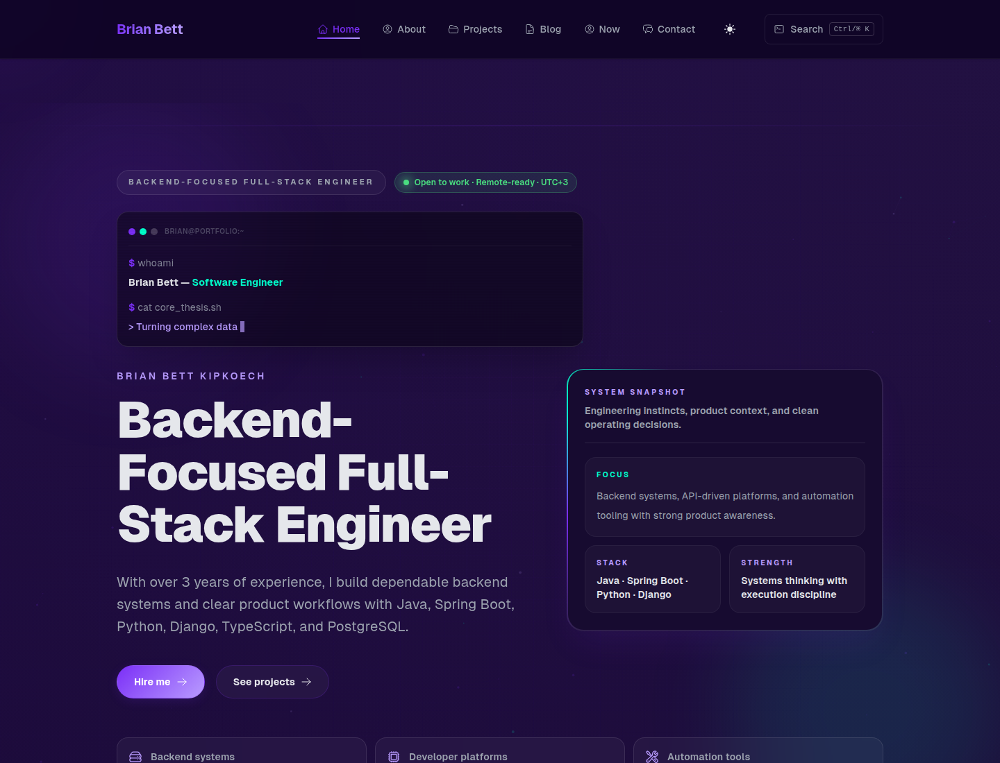
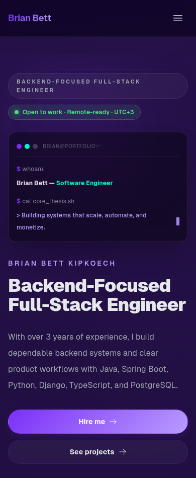

# Brian Bett Kipkoech | Portfolio

Personal portfolio for **Brian Bett Kipkoech**, a backend-focused full-stack engineer. It presents selected work, career details, technical writing, and a direct contact path.

Built with Next.js 15 App Router, React 19, TypeScript, Tailwind CSS 4, Framer Motion, Prisma, Jest, and MDX. The site supports dark and light themes and is designed for recruiters, engineering teams, and freelance clients.

## Preview

Screenshots show the current home page at desktop and mobile viewport sizes. Refresh them after meaningful visual changes with `npm run screenshots` while the production site is running locally.

| Desktop · 1440 × 1100 | Mobile · 390 × 950 |
| --- | --- |
|  |  |

## Start locally

Requirements: Node.js 22 and npm 10.8 or newer.

```bash
npm ci
cp .env.example .env.local
npm run dev
```

Visit <http://localhost:3000>. The public portfolio works without email credentials. Until Resend is configured, the contact form offers a mailto fallback. The private analytics dashboard requires its NextAuth credentials.

### Environment variables

| Variable | Needed for | Notes |
| --- | --- | --- |
| `NEXT_PUBLIC_SITE_URL` | Production metadata | Public origin used for canonical URLs, sitemap, RSS, and Open Graph. Example: `https://example.com`. |
| `RESEND_API_KEY` | Direct contact delivery | Resend API key. |
| `RESEND_FROM_EMAIL` | Direct contact delivery | Verified sender, for example `Portfolio <hello@example.com>`. |
| `NEXTAUTH_URL` | Private dashboard | Public origin used for authentication callbacks. |
| `NEXTAUTH_SECRET` | Private dashboard | Long random secret used to sign sessions. |
| `DATABASE_URL` | Prisma commands | SQLite URL for the current Prisma schema, for example `file:./prisma/dev.db`. The dashboard currently displays sample chart data. |

Vercel Web Analytics is enabled on Vercel deployments and does not use analytics cookies or need an additional key. Contact requests are limited per process in memory; use a shared store or edge limiter when deploying multiple instances.

## Routes

| Route | Purpose |
| --- | --- |
| `/` | Introduction, selected work, skills, career details, and contact links |
| `/about` | Background and engineering approach |
| `/projects` | Project index and filters |
| `/projects/[slug]` | Individual project case studies |
| `/blog` | MDX posts, tags, reading time, and table of contents |
| `/blog/tags/[tag]` | Posts grouped by tag |
| `/contact` | Contact form and email fallback |
| `/now` | Current focus, learning, and note |
| `/rss.xml` | Blog feed |
| `/analytics` | Private analytics dashboard |

The site also publishes `sitemap.xml`, `robots.txt`, per-route Open Graph images, and JSON-LD metadata.

## Where content lives

- **Profile, social links, availability, experience, education, certifications, testimonials, and `/now`:** [`src/content/profile.ts`](src/content/profile.ts). Testimonials are intentionally empty until real quotes are supplied.
- **Project case studies:** [`lib/projects.ts`](lib/projects.ts). Replace marked TODOs only with verified, shareable details. Keep private client information sanitized and do not add a source link for confidential work.
- **Blog posts:** MDX files in [`content/blog`](content/blog). Frontmatter supports `title`, `description` or `summary`, `date`, `tags`, `draft`, `thumbnail`, and `canonicalUrl`. Production builds omit drafts.
- **CV:** add `Brian-Bett-Kipkoech-CV.pdf` to [`public/cv`](public/cv). The download action stays hidden until the file exists.
- **Brand palette and theme surfaces:** CSS variables in [`app/globals.css`](app/globals.css). Update these tokens first when changing the visual identity; components use the tokens for surfaces, borders, accents, and status colors.

## Brand and themes

The core identity uses deep purple `#0d0221`, violet `#7b2ff7`, and cyan `#00ffcc`. Theme-specific accessible variants keep text, borders, and status colors readable in both dark and light modes. Reusable Tailwind tokens include `accent-primary`, `accent-secondary`, `accent-tertiary`, `ui-surface`, `ui-inset`, `ui-border`, and the semantic `status-*` colors.

When updating a component, use these tokens instead of adding one-off palette values. Keep white text for elements that sit on brand gradients, and reserve success, warning, and error tokens for those meanings.

## Screenshots

The screenshot helper uses a local Chrome/Chromium binary and writes two PNGs under `public/screenshots/`:

```bash
npm run build
npm run start
# In another terminal:
npm run screenshots
```

Set `PORTFOLIO_SCREENSHOT_URL` to capture another running deployment, `CHROME_BIN` to select a browser binary, or `PORTFOLIO_SCREENSHOT_THEME=light` to capture the light theme. `PORTFOLIO_SCREENSHOT_DIR=/tmp/portfolio-shots` writes review images outside the repo. Dark mode is used by default. Review the generated images before committing them.

## Checks

```bash
npm run lint
npm test -- --runInBand
npm run build
```

## Docker

Build and run the standalone production image:

```bash
docker build -t brian-portfolio .
docker run --rm -p 3000:3000 \
  -e NEXT_PUBLIC_SITE_URL=http://localhost:3000 \
  -e NEXTAUTH_URL=http://localhost:3000 \
  -e NEXTAUTH_SECRET=replace-with-a-long-random-secret \
  brian-portfolio
```

Add `RESEND_API_KEY` and `RESEND_FROM_EMAIL` to enable direct contact delivery. The container runs as an unprivileged user.

## Contributing and keeping this guide current

Update this README when routes, setup steps, environment variables, content locations, deployment behavior, or screenshot captures change. Keep command examples aligned with `package.json`, `.env.example`, and the Dockerfile. Use the screenshots to review both viewport sizes after visual updates.

## License

Portfolio content and project work are owned by Brian Bett Kipkoech. Contact Brian before reusing them.
